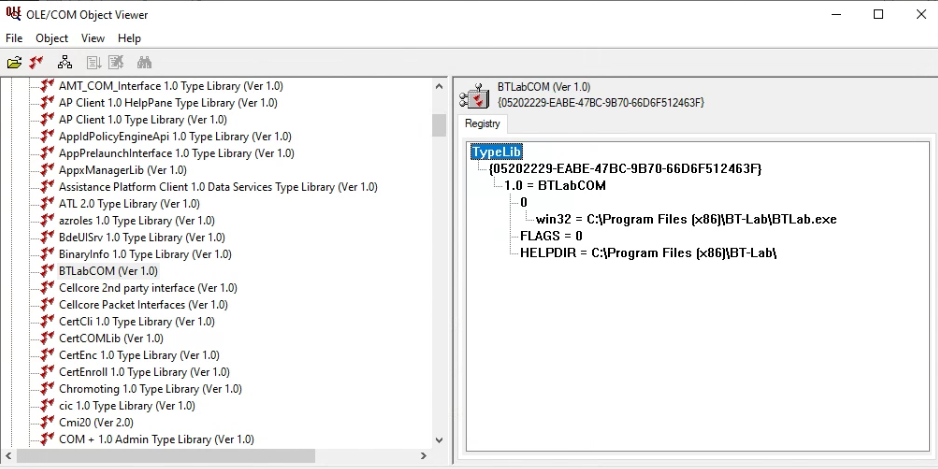
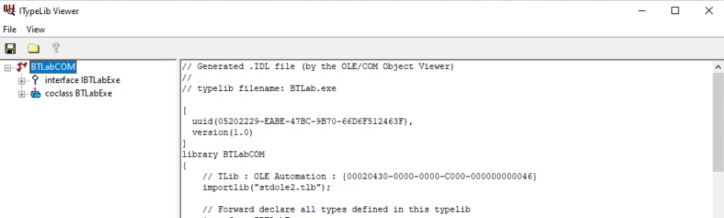

# Biologic-COM-Interface
Note: This is an unpolished tutorial on getting BTLab to communicate with programming languages through COM. This is not an official Biologic tutorial, and some of these steps require running commands as administrator, so use discretion in copying these steps. I do not claim this is the best, or the only way to interface with these COM modules. Please contact a Biologic service representative if you have questions or concerns.

### Background
The Biologic battery cycler's software BT-Lab does not have the ability to batch assign settings files to channels of interest and run channels simultaneously. Instead one needs to go in to each individual channel  and manually load in the settings file and specify the output file. To circumvent this BT-Lab has OLE/COM functionality. OLE/COM allows a user to programatically control an application based on the functions that the applications reveals in a consistent and standardized format. With this we will interact with BT-Lab using our programming language of choice. Python is demonstrated in this code, but I've tested this works in C++ and should work in other languages. This programmatic approach vastly reducing the amount of time required to batch start batteries on multiple channels. This tutorial assumes you already have BTLab installed and familiarity with its functionality. 

### Pre-Installation Steps
Some programs are needed prior to connecting to the BT-Lab COM module, namely: 
- [Windows SDK](https://developer.microsoft.com/en-us/windows/downloads/windows-sdk/) (Gives access to OLE/COM Viewer, MIDL, etc)
- [Visual Studio](https://visualstudio.microsoft.com/vs/features/cplusplus/) (needed to generate the tlb file even if you aren't using C++)
- [Python](https://www.python.org/downloads/) (Additional packages referenced later will need to be installed with pip)
 
### Register COM Object in Windows Registry
The next step is to register the COM object defined in the BTLab.exe file. During registration, the interfaces and type information exposed by the COM object are registered in the Windows Registry. This information helps applications that want to communicate with the COM object to understand its methods, properties, and interfaces. To do this open a Command Prompt with administrator privileges, navigate to the location of BTLab.exe, and run the below command:

```Command
BTLab /regserver
```
To confirm that this was successful, open Registry Editor and you should see BTLabCOM.BTLabExe in "Computer\HKEY_CLASSES_ROOT\" like the image below:


If you want to disconnect the COM control of BTLab run the below command:

```Command
BTLab /unregserver
```

This will remove the BTLab COM object from the windows registry.

### Getting the Type Library File

After verifying that COM object is seen within the windows registry, we will next get a Type Library (TLB) file. A TLB file is a binary file that contains metadata about the interfaces, methods, etc exposed by the COM object to provide a standardized way for different programming languages and development tools to understand how to interact with the COM component. We will first open OLE/COM Viewer (oleviewer.exe) as administrator. This program should have been installed with the Windows SDK and should be located in: \Program Files (x86)\Windows Kits\10\[version]\[architecture]\oleview.exe. You should be able to find BTLabCOM under the Type Libraries folder as shown below:


Double clicking on this item will open it in the ITypeLib Viewer where we will be able to save the file as an *.idl file in the working directory of our choice as shown below:



Now launch the Developer Command Prompt for VS (this is needed because it will put MIDL and CL.exe in to the working environment). From here navigate to where you saved the .idl file and run the below command:

```Command
midl filename.idl
```

This will generate the *.tlb file in the same directory.

### Using the Type Library File to Interact in a Programming Language
#### Python
In python you can run the below code to create the COM Object (will likely need to pip install comtypes):

```Python
import comtypes.client

# Replace with the actual path
typeLib = comtypes.client.GetModule("Path_to_tlb.tlb")
comObject = comtypes.client.CreateObject(typeLib.BTLabExe)
```

Once the COM object is made you can call any of the functions that were defined in the *.idl file. For further Documentation on these functions contact a Biologic service representative for their OLE/COM documentation
```Python
settingFile = "Setting_file_path.mps"
device = 0
channel = 1
comObject.LoadSettings(device, channel, settingFile)
```

When done with the COM object you can free the memory with:
```Python
del comObject
```

#### Batch Start Functionality

Now that we have the basics down of connecting to the COM object and sending it commands, we can perform more advanced functions like batch starting channels with different setting files. In the example shown below I am using the BTLabChannelStartList.csv file which contains a list of the settings file and output file for each channel I want to run. The code in biologicAutomation.ipynb loads in this csv and programmatically assigns settings files and output files to each channel and runs them. Click the below image for the video walkthrough:
[](https://www.youtube.com/watch?v=dTyfNcylDpQ)

